# FARMERS LEAGUE / VERIFIABLE RANDOM FOOTBALLER

## Table of Contents
- [Abstract](#abstract)
- [Addresses](#addresses)
- [KICK Token](#kick-token)
- [NFTs](#nfts)
    - [Attributes](#attributes)
        - [Preferred position](#preferred-position)
        - [Compatible positions](#compatible-positions)
        - [Defensive rating](#defensive-rating)
        - [Attacking rating](#attacking-rating)
    - [SVG Art](#svg-art)
        - [Special colors](#special-colors)
        - [Outfit colors](#outfit-colors)
        - [Haircut, beard and skin](#haircut,-beard-and-skin)
        - [Right hand position](#right-hand-position)
        - [Right leg position](#right-leg-position)
- [Loans and transfers](#loans-and-transfers)
    - [Loan](#loan)
        - [List a player](#list-a-player)
        - [Lend a player](#lend-a-player)
    - [Transfer](#transfer)
- [Teams](#teams)
    - [Create/remove a team](#create/remove-a-team)
    - [Applications](#applications)
    - [Releasing a player](#releasing-a-player)
    - [Current owner](#current-owner)
- [Games](#games)
    - [Team sign up](#team-sign-up)
        - [Stake](#stake)
        - [Layout](#layout)
    - [Challenge](#challenge)
        - [Decline a challenge](#decline-a-challenge)
    - [Game set up](#game-set-up)
    - [Player sign up](#player-sign-up)
    - [Players rates](#players-rates)
    - [Score goals](#score-goals)
        - [Defense average](#defense-average)
        - [Individual goal](#individual-goal)
        - [Collective goal](#collective-goal)
    - [Finish a game](#finish-a-game)
        - [Game result](#game-result)
        - [Rewards](#rewards)

## Abstract

The Farmers League is a fantasy football game, 100% on-chain.

It is based on an NFT collection of 10,000 players called the VRF for Verified Random Footballers.

The generation of the NFT is a fully on-chain process thanks to the use of Chainlink VRF (Verifiable Randomness Function). Each player has 100% on-chain SVG art + attributes.

The game mechanic itself is straight forward but has strong social and financial implications. To succeed in this game, players need good coordination, strategical consistency, and a bit of diligence.

Participants organize their players in teams. Then they challenge other teams. They put tokens at stake for the games (the dedicated ERC20 “KICK” token).

The game result depends for half on the players NFT attributes, half on the team building and the players commitment.

## Addresses

Website (under construction) : https://farmers-league.netlify.app/

Repo for smart contracts and scripts : https://github.com/0xBumstead/FarmersLeague

Repo for front end : https://github.com/0xBumstead/farmersleague-frontend

### Contract addresses on the Mumbai Testnet

- NFT (ERC721) - VerifiableRandomFootballer: [0xD7A8585B195b595A973090Abb8406E3029D9cFe3](https://mumbai.polygonscan.com/address/0xD7A8585B195b595A973090Abb8406E3029D9cFe3)
- ERC20 - KickToken: [0xCBb1a5BeC29b33225878042F4294832fb5D6768b](https://mumbai.polygonscan.com/address/0xCBb1a5BeC29b33225878042F4294832fb5D6768b)
- PlayerTransfer: [0x26342b83257DE4F2464c9324b69908372E272854](https://mumbai.polygonscan.com/address/0x26342b83257DE4F2464c9324b69908372E272854)
- PlayerLoan: [0xd87BA055EDF050B0d6AF1775d2abE470F0771f59](https://mumbai.polygonscan.com/address/0xd87BA055EDF050B0d6AF1775d2abE470F0771f59)
- LeagueTeam: [0xBC8765fe84598C70D48Ca3b3D63b9afe5Ff805B9](https://mumbai.polygonscan.com/address/0xBC8765fe84598C70D48Ca3b3D63b9afe5Ff805B9)
- LeagueGame: [0x0e5249a21BbaD5C1418F9d3b71dddd9669a1Aa6D](https://mumbai.polygonscan.com/address/0x0e5249a21BbaD5C1418F9d3b71dddd9669a1Aa6D)
- PlayerRate: [0xE6e49ECFafA22D4C550258B5b9d1D270Bf39F804](https://mumbai.polygonscan.com/address/0xE6e49ECFafA22D4C550258B5b9d1D270Bf39F804)
- GameResult: [0x25D47A5ef9a44d005E1558CAe31AABD7546DEDF9](https://mumbai.polygonscan.com/address/0x25D47A5ef9a44d005E1558CAe31AABD7546DEDF9)
- ClaimKickToken: [0x996198DF82B0773123a6405Bf978cA1426Cae6F6](https://mumbai.polygonscan.com/address/0x996198DF82B0773123a6405Bf978cA1426Cae6F6)

## KICK Token

KICK is the governance and economic token of the game. It has a max supply of 100,000,000.

This token is used in game for:
- player transfer
- player loan
- create a team
- release a player from a team
- enter into a game
- decline a challenge

The token distribution is 100% fair with no team allocation or private sale.
1% of the supply can be claimed by NFTs holders, each NFT can claim 100 tokens.

The rest is put in DAO treasury. Governance votes on how to split the token distribution through the followings:
- in game play-to-earn rewards
- liquidity providers rewards
- dev funds (grants)

When spent in game, the tokens go straight to the DAO treasury.

## NFTs

The generation of 10,000 unique NFTs  is a fully on chain process thanks to the use of Chainlink VRF. This guaranteed that every player is minted without post-reveal or rarity manipulation. Each player has 100% on chain SVG art + metadata, so they will always exist on the blockchain.

### Attributes

#### Preferred position
Each player has one preferred position that is randomly chosen into the following list, with a probability (%) of appearance.
- Goalkeeper (GK) 9%
- Center Back (DC) 18.92%
- Right Full Back (DR) 10.9%
- Left Full Back (DL) 7.3%
- Center Defensive Midfielder (DMC) 9.1%
- Right Defensive Midfielder (DMR) 5.5%
- Left Defensive Midfielder (DML) 3.6%
- Center Attacking  Midfielder (AMC) 9.1%
- Right Attacking Midfielder (AMR) 5.5%
- Left Attacking Midfielder (AML) 3.6%
- Center Forward (FC) 9.1%
- Right Forward (FR) 5.5%
- Left Forward (FL) 3.6%

The player with a left side preferred position are bit more rare and so, should be more valuable.

#### Compatible positions
In addition to its preferred position, a player can get up to 3 different compatible positions. A goalkeeper has always 0 compatible position. For the other players the number of compatible positions in randomly chosen between 0, 1, 2, 3 with the following distribution:
- 0 compatible position 29%
- 1 compatible position 26%
- 2 compatible positions 24%
- 3 compatible positions 21%

Each compatible position is randomly chosen in the same list that preferred position (GK excluded) but here every position has the same appearance probability (9.1%).

A player cannot get a compatible position identical to its preferred position.

#### Defensive rating
Each player has a defensive rating which is randomly chosen from 0 to 10. Simulations show that the ratings distribution should be roughly:
- 0 → 21%
- 1 → 10%
- 2 → 10%
- 3 → 10%
- 4 → 10%
- 5 → 10%
- 6 → 10%
- 7 → 9%
- 8 → 6%
- 9 → 3%
- 10 → 1%

The player’s preferred position has an influence on the probability to obtain a good defensive rating: the more defensive position, the higher the defensive rating should be.
For example, a goalkeeper has a 4% chance to get 0, and 6% chance to get 10 while a forward has 35% chance to get 0, and 0% chance to get 10.

Simulation shows that defensive ratings averages should be for each preferred position:
- Goalkeeper: 5.1
- Back positions: 4.3
- Defensive midfielders: 3.4
- Attacking midfielders: 2.9
- Forwards: 2.4

The side (left, right, center) has no influence on the defensive rating.

#### Attacking rating
Each player has an attacking rating which is randomly chosen from 0 to 10. Simulations show that the ratings distribution should be roughly:
- 0 → 28%
- 1 → 9%
- 2 → 9%
- 3 → 9%
- 4 → 9%
- 5 → 9%
- 6 → 9%
- 7 → 8%
- 8 → 6%
- 9 → 3%
- 10 → 1%

The player’s preferred position has an influence on the probability to obtain a good attacking rating: the more defensive position, the lower the attacking rating should be.
For example, a full back has a 30% chance to get 0, and 0% chance to get 10, while a forward has 7% chance to get 0, and 3% chance to get 10. Goalkeeper always have 0 in attacking rating.

Simulation shows that attacking ratings averages should be for each preferred position:
- Goalkeeper: 0.0
- Back positions: 2.7
- Defensive midfielders: 3.7
- Attacking midfielders: 4.1
- Forwards: 4.8

The side (left, right, center) has no influence on the attacking rating.

### SVG Art

Each NFT has a fully on chain unique SVG image.

#### Special colors
Background color : the default background color is light green. Players with a defensive rating >= 8 have 33% chance to get a bright green background and a 33% chance to get a bright orange background. So the final distribution should be :
- Light green : 94%
- Bright green : 3%
- Orange : 3%

Shoes color: the default shoes color is black. Players with a attacking rating >= 8 have 33% chance to get white shoes and a 33% chance to get gold shoes. So the final distribution should be :
- Black : 94%
-  White : 3%
-  Gold : 3%

#### Outfit colors
Ten different outfits have been designed (shirt main color, shirt side color, stripes colors, shorts color, socks main color, socks side color). They all have a 10% chance of occurring.

#### Haircut, beard and skin
Seven different haircuts exist with equal distribution (14.3% each).

3 different beard cuts exist. A player gets a 50% to be smooth-chinned, 20% to get the beard n°1, 20% chance to get beard n°2, 10% to get beard n°3.

The skin color is 50% chance to be white, 50% chance to be black.

The hair color is 25% chance to be blond, 25% chance to be brown, 25% chance to be red, 25% to be black.

#### Right hand position
Three different right hand positions exist with equal distribution.

#### Right leg position
Players with a sum of defensive and attacking ratings >10 get a 25% chance to get a moving right leg .

All the above characteristics are independent from each other.

## Loans and transfers

### Loan

A player’s owner who doesn’t want to play with it can lend it to someone else for a duration (which is counted in number of blocks but can be converted to regular time measure through the standard blockchain block time), and for a price (which is payable in KICK tokens).

#### List a player
The first step is to register the player in the «Players for loan List», with the player unique ID, the duration (=number of blocks) and the price (=number of KICK tokens). A listed player can be unlisted at any time. Only its owner can list/unlist a player.

#### Lend a player
Any listed player can be lent at any time by anyone. The borrower pays the required price in KICK tokens and gets registered as the player’s temporary owner for the duration of the loan. During this period, the real owner of the player can’t use it for anything related to the Farmers League Game. The borrower is able to use the player to sign it in a team, take part in games and a get in-game rewards, everything except create or remove a team.

97.5% of the lending price goes to the player’s owner, 2.5% (royalties) goes to the DAO treasury.

### Transfer

The transfer contract does the same thing that can be done on a NFT’s market place such as Opensea or Looks Rare, but it allows the transfers to be paid in KICK tokens instead of ETH or DAI.

On every transfer a 2.5% royalty (same % than Opensea) is taken from the seller and sent to the DAO treasury.

Like the loan contract, the transfer uses a list/unlist function to register a player in the «Player for transfer List» with the player unique ID and a price (=number of KICK tokens).

## Teams

### Create/remove a team

The games oppose teams not just players. In order to participate to the game, a player must be enrolled in a team.

Any player’s owner can create a team, with its player as long as the player is not already a member of another team and the player is not on loan. Creating a team is done through a player, which automatically become the team’s captain.

The captain is the first member of the team, and while the team exist the player can never leave it nor be part of another team. The captain’s owner can delete the team at any moment, which releases all the other players from the team at the same time.

A team can contain up to 23 players but needs at least 8 players to take part in a game. 

A player can’t be part of two different teams at the same time.

A fee in KICK tokens needs to be payed to the DAO treasury to create a team.

### Applications

Once the team is created, if a player’s owner wants to enroll its player in it, he needs to apply for the team. The owner can also cancel the application at any time. 

The captain’s owner can then validate the application making the applicant a new team member. The captain’s owner can also clear all the pending applications, turning down all the applicants to join the team.

A player can be an applicant for only one team at a time.

### Releasing a player

The captain’s owner can remove any player from its team at any time but in order to leave the team a player’s owner needs to pay a release clause, in KICK tokens.

So for leaving a team a player’s owner can either convince the captain’s owner to release him for free or pay the release clause. 97.5% of the release clause goes to the captain’s owner, 2.5% (royalties) goes to the DAO treasury.

### Current owner

Except for creating/removing a team, a player’s current owner is considered in regards to the loan status of the player.

## Games

### Team sign up

When a team is ready to enter the competition, its captain signs up the team to be registered as “waiting for an opponent” status.
As long as the team is still waiting for an opponent the captain’s owner can cancel the signing.

#### Stake
The captain’s pays an amount of KICK tokens that he wants to put at stake for its next game. The staked amount must be above a minimum decided by the governance but there is no maximum. The staked token are deposited in the contract and will be earned back if the team wins its game or sent to the opponent if the team loses.

In a game, the team with the higher stake gets a bonus of +2 on all the player ratings (defensive and attacking).

Choosing the staked amount is an important decision, how many tokens the team is willing to lose if they lose their next game? Knowing that the higher the stake, the higher the chance to win.

If the signing is canceled, the staked tokens are sent back to the captain’s owner.

#### Layout
When signing the captain’s owner must choose a layout for its team. 14 different layouts are up to choose:
- 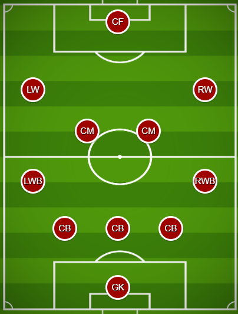
- 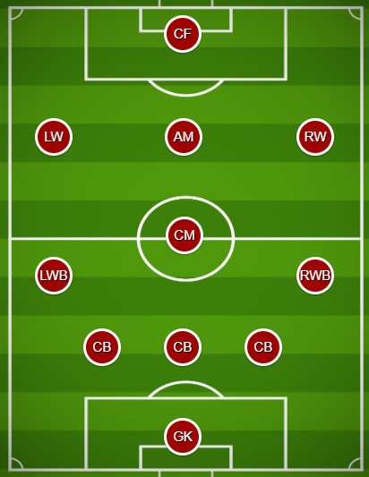
- 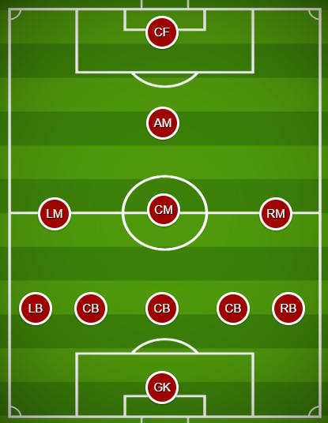
- 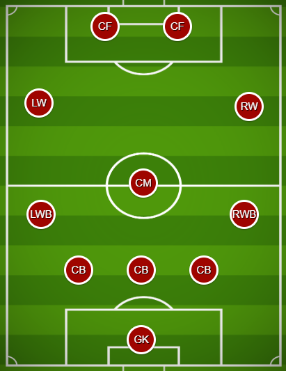
- 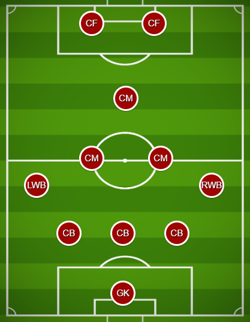
- 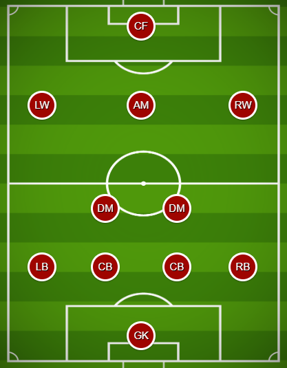
- 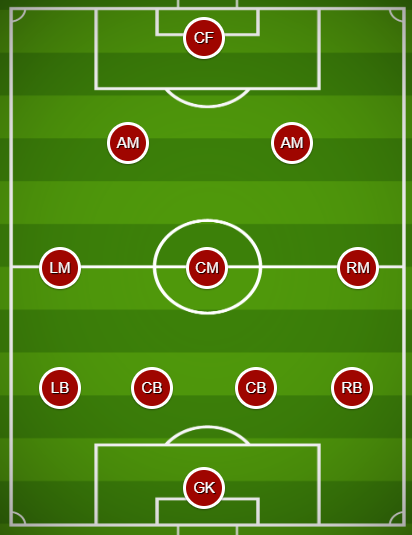
- 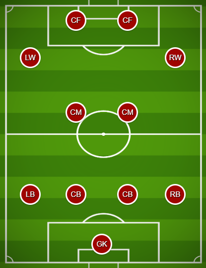
- 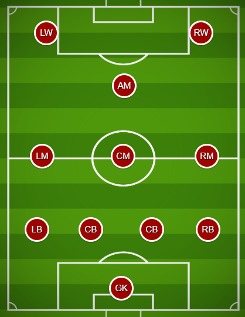
- 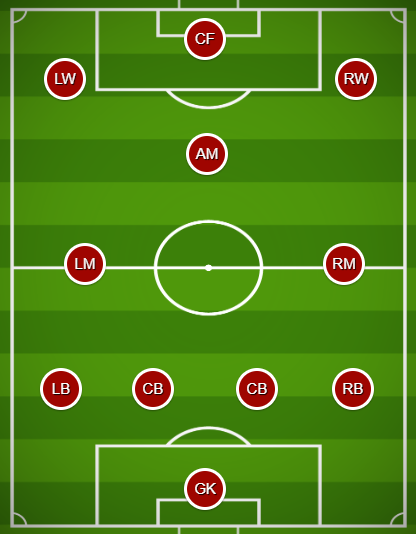
- 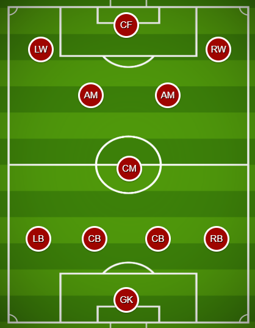
- 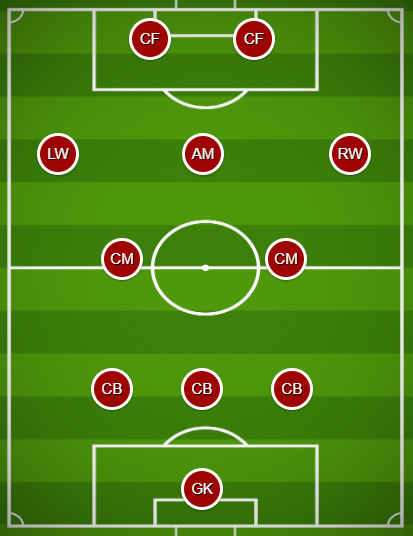
- 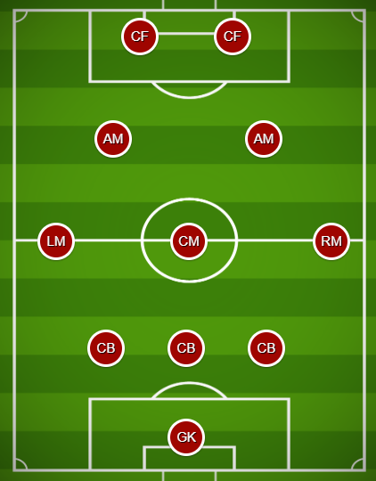
- 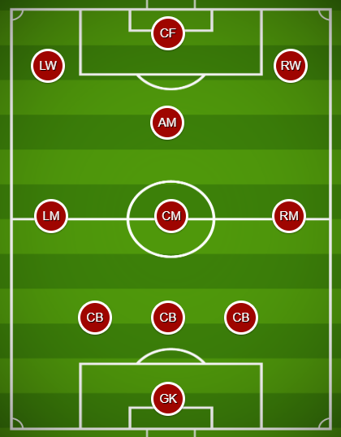

### Challenge

A team signed up can challenge any other signed up team as long as the other team is not already engaged into a game. The challenge must be done by the captain’s owner.

A challenge is associated with a standard duration, expressed in number of blocks (this can be converted to regular time measure through the standard blockchain block time). So a challenge will have a term which corresponds to the challenge moment plus the challenge duration.

#### Decline a challenge
The challenged team has until the challenge term to decline it. For declining a challenge, the challenge team needs to pay a fee, in KICK tokens, that goes entirely to the DAO treasury. Only the captain’s owner can decline a challenge.

For a challenged team, this a financial decision : is it better to pay to avoid facing a stronger opponent or take their chance in the game and risk their stake?

If the challenged team doesn’t want to decline, they don’t do anything, just wait for the challenge duration to pass.

A team cannot be challenged twice at the same time. A challenged team cannot challenge another team before declining the on-going challenge. A challenging team cannot be challenged by another team before its challenge is decline.

A challenge cannot be canceled.

### Game set up

Once the challenged is expired, anyone can trigger the requestGame function that will set up a game within the challenging team and the challenged team.

This function uses the Chainlink VRF to choose randomly between the two teams which one is the home team and which one is the away team. All the players from the home team receive a +1 bonus to their defensive and attacking ratings for the game.

The Chainlink VRF is also used to set a game time (moment when the game will occur) in the allowed delay window (anytime in the upcoming week for instance).  This game time is the most important feature because all the players willing to participate need to sign up within the game duration with different associated bonus depending on when they sign.

### Player sign up

Once a game is the set up with an associated time (randomly chosen by Chainlink VRF) all the players willing to participate need to sign up. 

Only the owner of the player can sign it. When signing a player, the owner chooses which position its player will occupy. Once a position is filled, it becomes unavailable for the next players.

The available positions depends on the layout chosen by the captain on the team sign up. All the team must coordinate in order to occupy all the positions with the best compatibility with each player attributes. 

Every layout has 5 substitutes open positions in addition to the 11 first team positions. The ratings attributes of the substitutes are not used for the game result but the number of signed substitutes provides a bonus to the first team players rates.

In order to sign up for a position, a player must be first be signed as a team member and not be already signed for another position.

The timing of the player’s sign up is important because of the bonus :
- Signing before the game starts is possible within an allowed window (12 hours for instance, but up for governance to choose). But this causes the player a -2 bonus of its ratings.
- Signing after the game ends is not allowed (ending of a game = game time + game duration).
- Signing shortly after a game starts allows the players to have a bonus (+1 or +2 depending if signing occurs during first half of the game or first 1/6, basically first 15 minutes).

### Players rates

At the end of a game, every signed up player gets two ratings, one defensive and one attacking. The ratings are calculated by adding several bonuses to the player original attributes. The best rating attribute a player can get is 10, and a player can collect up to a +10 bonus. So the best possible rate is 20. Some bonuses are negatives (penalties) but overall a player cannot get a rating below 0.
The bonuses are:
- Home team player : +1
- Team’s captain : +1
- Player signed on its preferred position : +2
- Player signed on one of its compatible positions : +1
- Player of a team that has at least 3 substitutes signed up : +1
- Player of a team that has 5 substitutes signed up : +1
- Player signed up before the beginning of the game : -2
- Player signed up during the first 1/6th of the game : +2
- Player signed up during the first half of the game : +1
- Player that has participated in another game not long before (and therefore is tired) : -2
- Player that has not participated in any game for a long time (and therefore is not fit) : -1 or -3 depending if the last game was before 4x the optimized duration between two games or before 8x.
- Player of a team which has the highest stake : +2
 
### Score goals

#### Defense average
At the end of the game, each team gets an collective defense rating which is an arithmetic average of the individual defensive ratings from its 11 players. 

If a team has less than 8 players signed up over the 11 positions, the average is calculated as if the team had 8 players. 

For example : a team has only 5 signed up players with the followings rates : 12, 6, 8, 9, 14. 

Its average is : (12 + 6 + 8 + 9 + 14 + 0 + 0 + 0 ) / 8 = 6.125

#### Individual goal
If a player has an attacking rating above the opponent defense average +3, the player scores an individual goal.

#### Collective goal
For every 3 players that have an individual attacking rating above the opponent defense average +1, and that have not scored an individual goal, the team gets a collective goal.

### Finish a game

#### Game result
By calculating each team’s goals (individual goals plus collective goals) the protocols sets the game results : home team wins, away team wins, draw.

#### Rewards
The winning team’s captain’s owner receives all the staked tokens of the opponent in addition to its own staked tokens, and a bonus in KICK Tokens taken from the contracts fund. With this bonus the winning reward is a positive sum for the teams.

